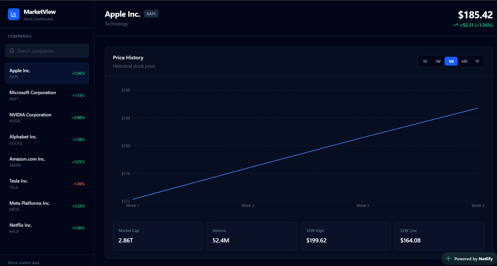
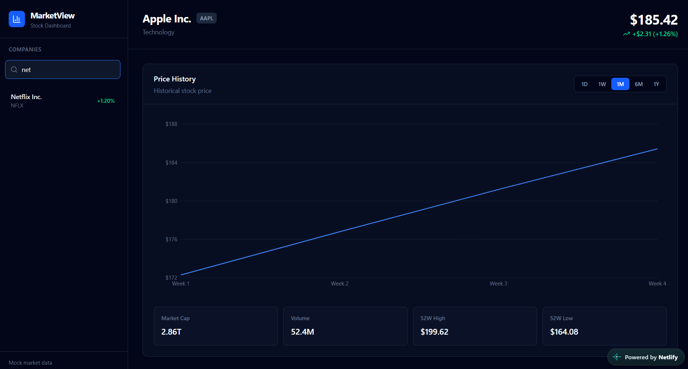
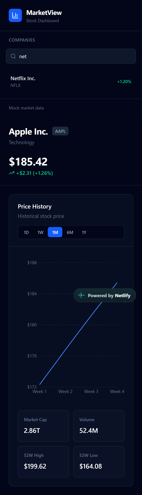

# MarketView — Interactive Stock Dashboard

MarketView is a responsive React-based stock dashboard that allows users to browse companies, search by company name or ticker symbol, and visualize historical stock prices using interactive charts.

> This project uses mock stock market data for demonstration purposes.

## Live Demo

https://marketviewdemo.netlify.app/

## Features

- Browse companies from a sidebar
- Search companies by name or ticker symbol
- Select a company dynamically
- View current mock stock information
- Interactive historical price chart
- Switch between multiple timeframes
- View market statistics
- Responsive desktop and mobile layout
- Empty states for unavailable data
- Keyboard-friendly interactive elements

## Tech Stack

- React
- Vite
- JavaScript
- Tailwind CSS
- Recharts
- Lucide React
- Git & GitHub

## Project Structure

```text
src/
├── components/
│   ├── Sidebar/
│   │   ├── Sidebar.jsx
│   │   └── CompanyList.jsx
│   │
│   └── Dashboard/
│       ├── Dashboard.jsx
│       ├── StockHeader.jsx
│       ├── StockChart.jsx
│       └── MarketStats.jsx
│
├── data/
│   └── stocks.js
│
├── App.jsx
├── index.css
└── main.jsx

## Screenshots

### Dashboard



### Search



### Mobile

